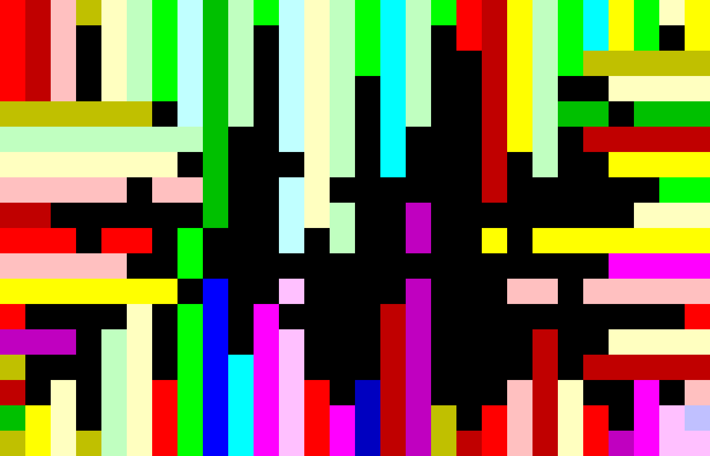

[Piet](https://www.dangermouse.net/esoteric/piet.html) is a programming language in which programs look like abstract paintings. The language is named after [Piet Mondrian](https://en.wikipedia.org/wiki/Piet_Mondrian), who pioneered the field of geometric abstract art.

\
\
This project is my participation in the exchange of ideas and inspiration of Dare-Zine magazine issue IV. You can find the issue [here](https://potayniche.com/shop/konceptualni/%D1%81%D0%BF%D0%B8%D1%81%D0%B0%D0%BD%D0%B8%D0%B5-%D0%B4%D0%B5%D1%80%D0%B7%D0%B0%D0%B9-dare-zine-%D0%B1%D1%80%D0%BE%D0%B9-4/).

\
\

Code written in Piet, digital.

\
\
The code prints “Dare-Zine” in a repeating, infinite loop. You can run it [here](https://www.bertnase.de/npiet/npiet-execute.php) (just upload the png).

\
\

Commands being executed step by step.\
[IDE used](https://gabriellesc.github.io/piet/). 

\
\

Code written in Piet, oil on canvas.
